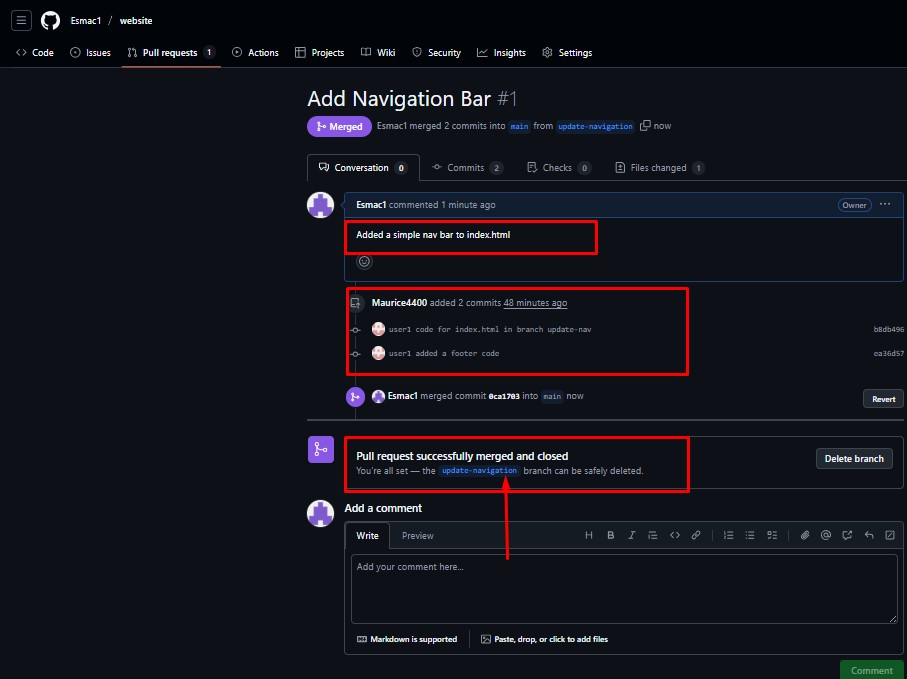

# Website Project

This is a collaborative website project.

### Project Directory
- User@DESKTOP-M80E2FN MINGW64 ~/Documents/myworkspacewebsite (main) containing the following HTML files:

- `index.html`
- `aboutus.html`
- `services.html`
- `contactinfo.html`
- `img/` (images folder)


## Collaboration Workflow

Although I'm the sole developer, I simulated a multi-user (user1 as Tom while user2 jerry) collaborative environment using Git branches.
---
## Workflow Summary

1. Clone the repository locally.
2. Create a new branch for your feature.
3. Make changes to your branch (example: add navigation or contact section).
4. Commit and push changes to your branch.
5. Create a **Pull Request** (PR) to merge into `main`.
6. Review and merge the PR after resolving any conflicts.
7. Pull the latest changes before starting new work.

---

## Collaboration Example

- **User1** created branch `update-navigation` and added a navigation bar to `index.html`.





- **User2** created branch `add-contact-info` and added a updated section to `index.html`.
- User1's branch was merged into `main` first.
- User2 pulled latest changes from `main`, resolved merge conflicts, and then merged their updates into `main`.


---

## Commands Cheat Sheet

```bash
# Clone repo
User1 as Tom, User2 as Jerry
git clone https://github.com/Esmac1/website.git

# Create and switch to a new branch
git checkout -b update-navigation

# Stage changes
git add filename

# Commit changes
git commit -m "   "

# Push branch to GitHub
git push origin add-contact-info

# Pull latest changes from main
git pull origin main

# Resolve conflicts if any, then
git add resolved-file
git commit -m "   "

# Create Pull Request (PR) on GitHub


